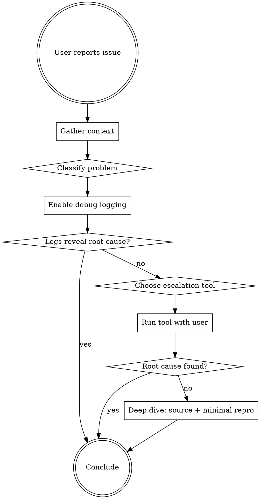

# Debugging rocprofiler-systems

Collaborative debugging for rocprofiler-systems issues. Work WITH the user through systematic triage, not autonomously.

<IMPORTANT>
This is a COLLABORATIVE skill. At each step:
1. Present findings and reasoning to the user
2. Ask before escalating to heavier tools (gdb, strace)
3. Never assume root cause without evidence
4. Never attach debuggers to processes without user confirmation
</IMPORTANT>

## When to Use

- Crashes or segfaults when profiling with rocprof-sys
- Missing, incorrect, or corrupted profiling output
- Instrumentation failures (Dyninst, symbol issues)
- Multiprocess (fork/MPI) or multithreaded app problems
- GPU/ROCm tracing or sampling failures
- Signal handling conflicts between app and profiler
- Profiling overhead issues

## When NOT to Use

- Quick usage questions -> `ask`
- Root cause known, planning a fix -> `planning-bugfix`
- Exploring code without a bug -> `exploration-explore-code`

## Workflow



## Phase 0: Gather Context

Use `AskUserQuestion` to collect:

| Question | Why |
|----------|-----|
| What command are you running? | Which tool: run, instrument, sample, causal |
| What happens vs what you expect? | Classifies the problem |
| Multiprocess? (fork, MPI) | Process-level complexity |
| Multithreaded? (pthreads, OpenMP, HIP) | Thread-level complexity |
| Works without rocprof-sys? | Isolates profiler vs app |
| ROCm version and GPU? | Hardware/driver context |

### Problem Classification

| Category | Indicators | Start With |
|----------|-----------|------------|
| Config/Setup | Wrong output, missing data | Logs, `rocprof-sys-avail` |
| Crash/Segfault | SIGSEGV, SIGABRT | Logs, then gdb |
| Hang/Deadlock | Never finishes | gdb attach, strace |
| Incorrect Output | Wrong values | Logs, trace query |
| Instrumentation Failure | Dyninst errors | Logs with `-vvv` |
| GPU/ROCm Issue | Missing GPU data | Logs, `amd-smi`, env vars |
| Multiprocess Issue | Fork/MPI failures | Logs with PID, `strace -f` |
| Performance Overhead | Profiled app too slow | Sampling config, `strace -c` |

## Phase 1: Log Analysis (Always Start Here)

### Enable Debug Logging

```bash
export ROCPROFSYS_LOG_LEVEL=debug   # trace|debug|info|warn|error|critical|off
export ROCPROFSYS_VERBOSE=3
export ROCPROFSYS_LOG_FILE=/tmp/rocprof-sys-debug.log

# For instrumentation issues
rocprof-sys-instrument -vvv -- ./app
```

### Check Configuration

```bash
rocprof-sys-avail -G /tmp/current-config.cfg --all
env | grep ROCPROFSYS
```

### Log Patterns

| Pattern | Meaning |
|---------|---------|
| `[critical]` or `[error]` | Direct failure |
| `throw` / `exception` | C++ exception |
| `signal` / `SIG` | Signal received - check if app or profiler |
| `fork` / `pid` | Process lifecycle |
| `pthread` / `thread` | Thread lifecycle |
| `perfetto` | Trace backend issues |
| `dyninst` / `instrumentation` | Binary rewriting |
| `rocm` / `hip` / `hsa` | GPU subsystem |

**Decision point:** Present log findings to user. If root cause is clear, go to Phase 4. Otherwise, escalate.

## Phase 2: Tool Escalation

Ask user before using any of these tools. Explain WHY the chosen tool fits.

### Tool Selection

| Problem | Tool | Reason |
|---------|------|--------|
| Crash/signal | gdb | Inspect crash state, backtrace |
| Hang/deadlock | gdb attach + strace | See what's blocked |
| Syscall failures, missing files | strace | Trace OS interactions |
| Library call issues | ltrace | Trace shared library calls |
| GPU device issues | `amd-smi` | Check GPU visibility and state |
| Library deps | ldd | Check shared library resolution |
| Symbol issues | nm / objdump | Check symbol availability |
| Memory issues | valgrind | Detect memory errors |

### rocprof-sys-specific gdb Tips

Standard gdb usage applies. These are rocprof-sys-specific considerations:

- Look for `rocprof` frames in backtrace to distinguish profiler vs app crash
- For **fork/MPI**: `set follow-fork-mode child` or attach to specific rank PID
- For **threads**: `thread apply all bt` to see all thread states
- Useful breakpoints: `rocprofiler_systems_v1::configure`, `fork_gotcha::audit`

### rocprof-sys-specific strace Tips

- **Always** use `-f` for threaded apps, `-ff -o prefix` for multiprocess
- Watch for `open("/dev/kfd")` failures (GPU access)
- Repeated `futex(FUTEX_WAIT)` suggests deadlock in profiler
- For MPI: `mpirun -n 4 strace -ff -o /tmp/strace-mpi rocprof-sys-run -- ./app`

## Phase 3: Deep Dive

If Phase 2 narrows but doesn't resolve, inspect source or create minimal repro.

**Source inspection:** Use `exploration-explore-code` to navigate the rocprof-sys source when needed.

### Minimal Reproduction

1. Strip app to smallest failing case
2. Isolate rocprof-sys mode (run vs instrument vs sample)
3. Remove optional features one at a time (GPU, MPI, sampling)
4. Test with simplest preset (`--balanced`)

## Phase 4: Conclude

Summarize: problem, root cause, evidence, tools used, resolution.

If code fix needed, suggest `planning-bugfix`.

## Known Gotchas

| Gotcha | Details |
|--------|---------|
| Fork + OpenMPI + libfabric | May segfault; use binary rewrite instead of runtime |
| GPU handles after fork | AMD SMI reinitializes in parent, disabled in child |
| Perfetto buffer overflow | Increase `ROCPROFSYS_PERFETTO_BUFFER_SIZE_KB` |
| Thread vs process sampling | Different env vars control each |
| Signal conflicts | App and profiler may both want SIGPROF/SIGALRM |

## Common Mistakes

| Mistake | Fix |
|---------|-----|
| Jumping straight to gdb | Check logs first - most issues are config errors |
| strace without `-f` on threaded apps | Always `-f` for threads, `-ff` for multiprocess |
| Not testing without profiler first | Isolate profiler vs app issue |
| Ignoring env vars | Always `env \| grep ROCPROFSYS` |
| Skipping `rocprof-sys-avail` | Validates config before deeper debugging |

## Integration

| After This Skill | Use |
|------------------|-----|
| Root cause found, fix needed | `planning-bugfix` |
| Need to understand code area | `exploration-explore-code` |
| Fix needs tests | `testing-gtest-gmock` or `testing-pytest` |
