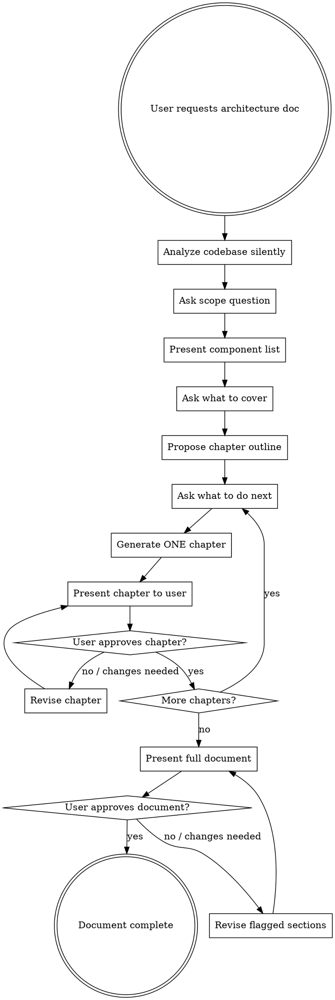

# Architecture Documentation

Generate architecture documentation through iterative, user-guided chapter-by-chapter creation. The output describes component behavior, interactions, hierarchy, and expansion points -- never code.

## Overview

This skill produces architecture documents by first analyzing the codebase silently, then collaborating with the user to scope, outline, and iteratively write each chapter with approval between every one.

**Core principle:** The user controls what gets documented and approves every chapter. The agent never generates the full document at once.

## Process Flowchart



## Phase 1: Analyze (Silent)

Explore the codebase to build understanding BEFORE asking the user anything. Use `Task` with `subagent_type=Explore` or read files directly.

**Goal:** Understand enough to present an informed component list to the user.

Identify:
- All major components, modules, subsystems
- How they interact (calls, data flow, dependencies)
- Component hierarchy (parent-child, inheritance, composition)
- Expansion points (plugin interfaces, abstract classes, configuration)
- Architectural weaknesses (coupling, missing abstractions, drift)

**Do NOT output analysis results yet.** This phase is preparation for the user conversation.

## Phase 2: Ask Scope

Use `AskUserQuestion` to ask:

**"What is the scope of this architecture document?"**
- Single component (one module, class, or subsystem)
- Multiple components / integration (how 2+ components work together)
- Whole system (end-to-end architecture)

Wait for answer before proceeding.

## Phase 3: Present Components and Ask What to Cover

Present a list of ALL components you discovered during analysis. Format as a table:

```markdown
## Components Found

| # | Component | Purpose | Key Interactions |
|---|-----------|---------|-----------------|
| 1 | ComponentA | Brief purpose | Interacts with B, C |
| 2 | ComponentB | Brief purpose | Depends on A |
| ...| ... | ... | ... |
```

Then ask: **"Which components should the document cover? Select by number or describe what to include/exclude."**

Wait for answer before proceeding.

## Phase 4: Propose Chapter Outline

Based on scope and selected components, propose a chapter outline. Typical chapters:

1. System Overview (purpose, high-level description)
2. Component Hierarchy (structure, ownership, layering)
3. Component Interactions (data flow, call patterns, protocols)
4. Expansion Points (where and how to extend)
5. Weaknesses and Risks (architectural problems, improvement opportunities)

Present the outline and ask: **"What should be done next? Should I adjust the outline, add/remove chapters, or start generating?"**

<IMPORTANT>
You MUST wait for the user's response before generating ANY chapter content. Never start writing chapters without explicit user direction.
</IMPORTANT>

Wait for answer before proceeding.

## Phase 5: Chapter-by-Chapter Generation

Generate ONE chapter at a time. After writing each chapter, present it and ask for feedback.

### For each chapter:

1. **Generate** the chapter content
2. **Present** it to the user
3. **Ask:** "What do you think about this chapter? Is it okay, or what should I change?"
4. **Wait** for user response
5. If changes requested: revise and present again (loop until approved)
6. If approved: ask "What should be done next?" before proceeding to next chapter

<IMPORTANT>
NEVER generate multiple chapters at once. NEVER proceed to the next chapter without explicit user approval of the current one. This is the most critical rule of this skill.

**No exceptions:**
- Not "the chapters are short, I'll batch them"
- Not "the user seems to want the whole doc fast"
- Not "these chapters are closely related, better together"
- Not "I'll generate all and let them review at the end"

ONE chapter. Present. Wait. Get approval. Then next.
</IMPORTANT>

### Content Rules

**What to include in chapters:**
- How components behave (responsibilities, lifecycle, state)
- How components interact (which calls which, data flow direction, protocols)
- Component hierarchy (parent-child, composition, layering)
- Expansion points (where new components plug in, what interfaces to implement)
- Weaknesses (tight coupling, missing abstractions, scalability concerns)

**What to NEVER include:**

| Forbidden | Why | Use Instead |
|-----------|-----|-------------|
| Code snippets | Document describes architecture, not implementation | Describe behavior in prose |
| Inline code (`backtick code`) | Same as code snippets | Name functions/classes without backticks |
| ASCII art diagrams | These are a form of code | Describe relationships in prose or tables |
| File paths as structure trees | Code-like representation | Describe directory organization in prose |
| Configuration examples | Implementation detail | Describe what is configurable |
| Command examples | Implementation detail | Describe what operations are available |

<IMPORTANT>
NO CODE SNIPPETS means NO CODE SNIPPETS. Not "just a small one for clarity." Not "just showing the interface." Not "just the function signature." The document describes HOW components BEHAVE and INTERACT, using natural language and tables only.

This includes:
- No fenced code blocks (```)
- No inline code (single backticks for code)
- No pseudo-code
- No directory trees with box-drawing characters
- No ASCII architecture diagrams

Use prose paragraphs and markdown tables to describe everything.
</IMPORTANT>

## Phase 6: Full Document Review

After ALL chapters are approved individually, present the complete assembled document.

Ask: **"Here is the full document with all chapters. Please review it as a whole. Is anything missing, inconsistent, or needs adjustment?"**

Loop until user confirms the full document is correct:
1. User flags issues -> revise flagged sections -> present full document again
2. User approves -> done

## Output

Save the final approved document to: `planning/architecture-<scope-name>.md`

## Red Flags - STOP and Fix

- **Generating without asking scope** - Go back to Phase 2
- **Skipping component list** - Go back to Phase 3
- **Writing multiple chapters at once** - Delete extra chapters, present one at a time
- **Including code snippets** - Remove all code, rewrite in prose
- **Proceeding without user approval** - Stop and ask for feedback
- **"User is in a hurry"** - The iterative process IS the value. Follow it.
- **"These chapters are related"** - Still one at a time. No batching.
- **"I'll add just a small code example"** - No. Describe behavior in words.

## Common Mistakes

| Mistake | Fix |
|---------|-----|
| Generating entire document at once | ONE chapter at a time with approval between each |
| Including code snippets "for clarity" | Describe behavior in prose and tables only |
| Skipping scope question | Always ask scope FIRST (single/multi/whole) |
| Deciding components without asking user | Present full list, let user choose |
| Not asking "what next?" before generation | Always give user control of pacing |
| Using ASCII diagrams | Describe structure in prose or tables |
| Skipping final whole-document review | Always do a final review after all chapters |

## Rationalizations to Reject

| Excuse | Reality |
|--------|---------|
| "User is in a hurry, I'll generate it all" | Iterating chapter-by-chapter prevents rework. Follow the process. |
| "The scope is obvious from context" | Confirm anyway. "Architecture" could mean many things. |
| "These chapters are small, I'll batch them" | Small chapters are fast to approve. One at a time. |
| "Just one small code example helps" | Prose explains architecture better. No code means no code. |
| "I'll show the directory tree for context" | Describe the directory organization in words. |
| "ASCII diagram is not really code" | It is a code-like representation. Use prose or tables. |
| "User already told me the components" | Present the full list anyway so they can discover components they missed. |
| "I'll generate all and they can cherry-pick" | That inverts the process. One chapter, one approval. |

## Integration with Other Skills

| Before This Skill | Use |
|-------------------|-----|
| Exploring unfamiliar code | `exploration-explore-code` |

| After This Skill | Use |
|------------------|-----|
| Planning new features based on architecture | `planning-feature` |
| Refactoring based on weaknesses found | `planning-refactor` |
