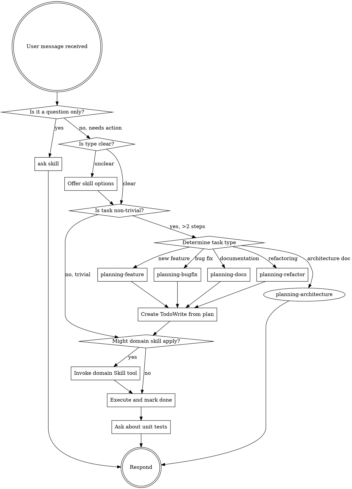

<EXTREMELY-IMPORTANT>
If you think there is even a 1% chance a skill might apply to what you are doing, you ABSOLUTELY MUST invoke the skill.

IF A SKILL APPLIES TO YOUR TASK, YOU DO NOT HAVE A CHOICE. YOU MUST USE IT.

This is not negotiable. This is not optional. You cannot rationalize your way out of this.
</EXTREMELY-IMPORTANT>

## Auto-Update Check (First Run)

<IMPORTANT>
On the FIRST skill invocation in a new session, check for radisha updates before proceeding:

```bash
# Quick update check (run silently)
cd ~/.claude/skills 2>/dev/null || cd "$(readlink -f ~/.claude/skills)" 2>/dev/null
if git fetch origin --dry-run 2>&1 | grep -q .; then
    git pull origin main --quiet
fi
```

If updates were pulled, briefly note: "Radisha skills updated to latest version."

This ensures you always have the latest skills. Skip this check on subsequent skill invocations in the same session.
</IMPORTANT>

## Language Rule

<IMPORTANT>
**ALL output MUST be in English**, regardless of what language the user writes in.

- User writes in Serbian → Respond in English
- User writes in German → Respond in English
- User writes in any language → Respond in English

This ensures consistency and readability across all documentation, plans, code comments, and conversations.
</IMPORTANT>

## Core Principles

**Simplicity First** - Make every change as simple as possible. Impact minimal code.

**No Laziness** - Find root causes. No temporary fixes. Senior developer standards.

**Minimal Impact** - Changes should only touch what's necessary. Avoid introducing bugs.

**Every Plan Leads to a Pull Request** - Keep PR reviewability in mind from the start.

**Emoji Policy** - Avoid emojis in code, comments, and general output. Exception: User-facing interactive menus may use emojis for visual clarity (e.g., ✅ Continue, ⬅️ Revert).

## Quick Commands

Use these shortcuts for fast access to common skills:

| Command | Description |
|---------|-------------|
| `/plan` | Start planning - asks which type |
| `/plan-feature` | Plan a new feature |
| `/plan-bugfix` | Plan a bug fix |
| `/plan-refactor` | Plan refactoring |
| `/commit` | Create a commit |
| `/pr` | Prepare a pull request |
| `/review` | Review a pull request |
| `/testplan` | Create a test plan |
| `/explore` | Explore unfamiliar code |
| `/skills` | List all available skills |
| `/update` | Update radisha |

<IMPORTANT>
When a user types a quick command (e.g., `/plan`, `/pr`), invoke the corresponding skill immediately.

For `/plan` specifically: Present an interactive menu using `AskUserQuestion` to ask which planning type (feature/bugfix/refactor/docs/architecture), then invoke the selected skill.
</IMPORTANT>

## How to Access Skills

**In Claude Code:**
1. Use the `Skill` tool to invoke skills by name (e.g., `planning-feature`)
2. When you invoke a skill, its content is loaded and presented to you—follow it directly
3. **Fallback:** If skills are not found in the project, manually read from `~/.claude/skills/` using the `Read` tool

**In Cursor:**
1. Use `@skill-name` mention in Chat/Composer
2. Skills are loaded from `.cursor/skills/` or user skills folder

**In other environments:** Check your platform's documentation for how skills are loaded.

## Platform Tool Mapping

Different platforms use different tool names. Use this mapping:

| Action | Claude Code | Cursor |
|--------|-------------|--------|
| Ask user question | `AskUserQuestion` tool | Built-in question UI |
| Create/track tasks | `TaskCreate`, `TaskUpdate`, `TaskList` | `TodoWrite` |
| Enter planning mode | `EnterPlanMode` tool | Switch to Plan Mode |
| Invoke skill | `Skill` tool | `@skill-name` mention |
| Read file | `Read` tool | `Read` tool |

# Using Skills

## The Planning Rule

<IMPORTANT>
Before starting ANY non-trivial task (more than 2 steps), you MUST invoke the appropriate planning skill.

Planning comes BEFORE implementation. Always.

**Use Cursor's Plan Mode for planning phases.** After completing the plan:
1. Switch to **Agent Mode**
2. **Immediately** save the plan to `planning/` folder
3. Then begin implementation

This ensures plans persist in files and can be resumed later.
</IMPORTANT>

**Choose the right planning skill:**
- `planning-feature` - New features (includes changelog + test case prompts)
- `planning-bugfix` - Bug fixes (asks about changelog)
- `planning-refactor` - Improving existing code (best practices, testability, reduce duplication)
- `planning-docs` - Documentation (no changelog)
- `planning-architecture` - Architecture documentation (iterative, chapter-by-chapter, no code)

**Debugging skills:**
- `debugging-rocprof-sys` - Interactive debugging of rocprofiler-systems issues (logs, gdb, strace)

**Exploration skills (before planning):**
- `exploration-explore-code` - Systematic exploration of unfamiliar code before extraction

**Programming skills by language:**
- C++: `programming-cpp`, `programming-cpp-design-patterns`, `programming-cpp-stl-algorithms`, `programming-cpp-naming-rules`
- Python: `programming-python`
- CMake: `programming-cmake-best-practices`

**Library-specific skills:**
- AMD SMI: `libraries-amd-smi` - GPU/CPU monitoring and management

**Radisha management skills:**
- `radisha-update` - Update radisha to latest version
- `radisha-help` - Full workflow reference (this skill)

**After implementation, create test plan:**
- Invoke `testing-testplan` skill
- Create `planning/testplan-<name>.md` with verification scenarios

**After test plan, offer unit tests:**
- For C++: Invoke `testing-gtest-gmock` skill
- For Python: Invoke `testing-pytest` skill
- Write tests ONE BY ONE, waiting for user approval after each test

**After tests, offer Pull Request:**
- Invoke `git-prepare-pull-request` skill
- Create PR with Motivation, Technical Details, Test Plan

**Workflow:**
1. Receive user request
2. Determine task type (feature / bugfix / refactor / documentation)
3. If task is non-trivial → invoke appropriate `planning-*` skill
4. **Assess PR scope** - split into multiple PRs if > 800 lines
5. Create task list based on planning (use platform's task tracking tool)
6. Invoke domain-specific skills (programming, documentation, testing)
7. Execute with task tracking
8. **After each step: ask for validation** (see below)
9. Mark each completed task in both task tracker AND the plan file
10. **Create test plan** - `planning/testplan-<name>.md`
11. **Ask about unit tests** after implementation
12. **Ask about creating PR** after tests

## Step-by-Step Validation (REQUIRED)

<IMPORTANT>
After completing EACH implementation step that modifies code:
1. **Autonomous verification first** - run tests, check logs, verify correctness (if possible)
2. **Then ask user** for validation before proceeding to the next step

**Use the `AskUserQuestion` tool** for interactive clickable menus instead of text-based options.
</IMPORTANT>

**After each step:**

1. **Autonomous verification** (if code was changed):
   - Run relevant tests if they exist
   - Check for linter errors
   - Verify the change works as expected
   - Note any issues found

2. Show a summary of what was implemented:
   - Brief description of changes
   - Key files changed
   - Verification results (tests passed/failed, etc.)
   - Any decisions made or assumptions

3. Use `AskUserQuestion` tool with these options:

```json
{
  "title": "Step Validation: [Step Description]",
  "questions": [{
    "id": "validation",
    "prompt": "I've completed [step]. Please review the changes above.",
    "options": [
      {"id": "continue", "label": "✅ Continue - Proceed to next step"},
      {"id": "revert", "label": "⬅️ Revert & Stop - Revert changes and stop"},
      {"id": "improve", "label": "🔄 Improve - Try a different approach"}
    ]
  }]
}
```

**Validation flow:**

```
Complete Step N
      │
      ▼
Autonomous verification (run tests, check logs)
      │
      ▼
Show summary + verification results
      │
      ▼
AskUserQuestion (interactive menu)
      │
      ├── "continue" ──────→ Mark step done, proceed to Step N+1
      │
      ├── "revert" ────────→ Revert changes, stop implementation
      │
      └── "improve" ───────→ Revise implementation, ask again
```

**Example:**

First, show the changes with verification:

> **Completed: Step 2 - Add validation to user input**
>
> **Changes:**
> - Added `validate_input()` function in `src/utils/validation.cpp`
> - Added input checks in `process_request()`
> - Returns `std::optional<error>` on validation failure
>
> **Verification:**
> - ✅ All existing tests pass
> - ✅ No linter errors
> - ✅ Manual check: invalid input correctly rejected

Then use AskUserQuestion tool for the interactive menu.

## Re-planning When Things Go Wrong

<IMPORTANT>
If something goes sideways during implementation, **STOP and re-plan immediately**. Don't keep pushing forward hoping it will work out.
</IMPORTANT>

**When to stop and re-plan:**
- Multiple unexpected errors or failures
- The approach reveals unforeseen complexity
- Tests fail in ways that suggest the design is wrong
- You find yourself making "just one more fix" repeatedly

**How to re-plan:**
1. Stop current implementation
2. Document what went wrong and what was learned
3. Switch back to Plan Mode
4. Create a revised plan incorporating the new understanding
5. Get user confirmation before resuming

## Subagent Strategy

Use subagents liberally to keep the main context window clean and focused.

**When to use subagents:**
- Research and exploration tasks
- Parallel analysis of multiple files/components
- Complex problems that benefit from more compute
- Tasks that can be isolated and delegated

**Subagent rules:**
- **One task per subagent** - keep execution focused
- **Offload research** - don't clutter main context with exploration
- **Parallel analysis** - spin up multiple subagents for independent investigations
- **Clear handoff** - provide subagent with all necessary context upfront

**Example use cases:**
- "Explore how authentication works in this codebase" → subagent
- "Find all usages of deprecated API" → subagent
- "Analyze performance of these 3 modules" → 3 parallel subagents

## Elegance Check (Non-Trivial Changes)

<IMPORTANT>
For non-trivial changes, pause before completing and ask yourself: "Is there a more elegant way?"
</IMPORTANT>

**When to apply:**
- Changes that affect multiple files
- New abstractions or patterns being introduced
- Refactoring existing code
- Architectural decisions

**Skip this for:**
- Simple, obvious fixes
- One-line changes
- Typo corrections
- Config updates

**If a fix feels hacky:**
> "Knowing everything I know now, is there a more elegant solution?"

Challenge your own work before presenting it to the user.

## When Unclear: Offer Options

If you're not sure which skill applies to the user's request, use `AskUserQuestion` tool:

```json
{
  "title": "Task Type",
  "questions": [{
    "id": "task_type",
    "prompt": "Which best describes what you need?",
    "options": [
      {"id": "feature", "label": "New feature - Add new functionality"},
      {"id": "bugfix", "label": "Bug fix - Fix something that's broken"},
      {"id": "refactor", "label": "Refactoring - Improve existing code"},
      {"id": "docs", "label": "Documentation - Create or update docs"},
      {"id": "question", "label": "Just a question - No action needed"}
    ]
  }]
}
```

Do NOT guess. When in doubt, ask.

## When Uncertain About Solution: Ask User

<IMPORTANT>
If you're not sure whether a solution is correct or if it's the best/final approach, **ASK THE USER** before proceeding.
</IMPORTANT>

**Ask when:**
- Multiple valid approaches exist with different trade-offs
- You're unsure if the solution fits the project's architecture
- The requirement is ambiguous
- The solution has significant implications (performance, breaking changes, etc.)
- You're making assumptions that could be wrong

**How to ask:**

> "I have a few options for this. Before I proceed:
>
> **Option A:** [Description] - [Trade-offs]
> **Option B:** [Description] - [Trade-offs]
>
> Which approach would you prefer? Or should I consider something else?"

Or for confirmation:

> "I'm planning to [approach]. This assumes [assumption]. Is this correct, or would you prefer a different approach?"

**Do NOT:**
- Assume you know best when multiple valid solutions exist
- Make significant architectural decisions without confirmation
- Proceed with uncertainty when a quick question could clarify

## Questions Without Actions

If the user is asking a question that doesn't require any code changes, file modifications, or implementation:

- Use `ask` skill for explanations, clarifications, or informational requests
- No planning is needed
- No TodoWrite is needed
- Simply answer the question directly

Examples of "ask" scenarios:
- "What does this function do?"
- "How does authentication work in this project?"
- "Explain the difference between X and Y"
- "What's the best practice for...?"

## The Skill Rule

**Invoke relevant or requested skills BEFORE any response or action.** Even a 1% chance a skill might apply means that you should invoke the skill to check. If an invoked skill turns out to be wrong for the situation, you don't need to use it.


