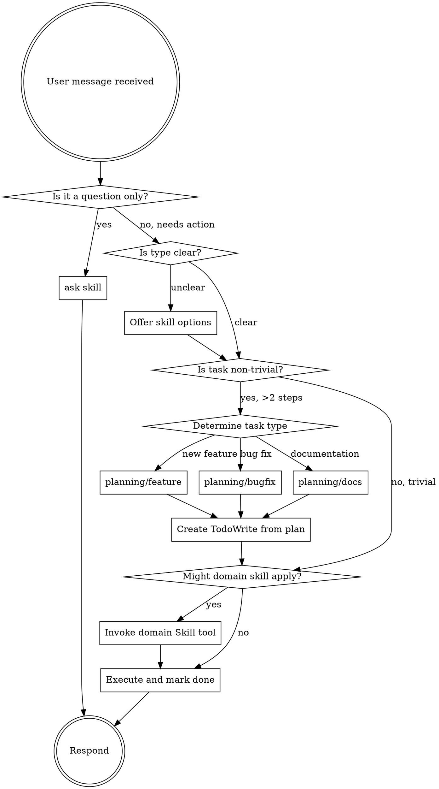

<EXTREMELY-IMPORTANT>
If you think there is even a 1% chance a skill might apply to what you are doing, you ABSOLUTELY MUST invoke the skill.

IF A SKILL APPLIES TO YOUR TASK, YOU DO NOT HAVE A CHOICE. YOU MUST USE IT.

This is not negotiable. This is not optional. You cannot rationalize your way out of this.
</EXTREMELY-IMPORTANT>

## How to Access Skills

**In Claude Code:** Use the `Skill` tool. When you invoke a skill, its content is loaded and presented to you—follow it directly. Never use the Read tool on skill files.

**In other environments:** Check your platform's documentation for how skills are loaded.

# Using Skills

## The Planning Rule

<IMPORTANT>
Before starting ANY non-trivial task (more than 2 steps), you MUST invoke the appropriate planning skill.

Planning comes BEFORE implementation. Always.
</IMPORTANT>

**Choose the right planning skill:**
- `planning/feature` - New features (includes changelog + test case prompts)
- `planning/bugfix` - Bug fixes (asks about changelog)
- `planning/docs` - Documentation (no changelog)

**Workflow:**
1. Receive user request
2. Determine task type (feature / bugfix / documentation)
3. If task is non-trivial → invoke appropriate `planning/*` skill
4. Create TodoWrite list based on planning
5. Then invoke domain-specific skills (programming, documentation, testing)
6. Execute with todo tracking
7. **After each step: ask for validation** (see below)
8. Mark each completed task in both TodoWrite AND the plan file

## Step-by-Step Validation (REQUIRED)

<IMPORTANT>
After completing EACH implementation step, you MUST ask for user validation before proceeding to the next step.
</IMPORTANT>

**After each step, present these options:**

> "I've completed [step description].
>
> **Please review and choose:**
> 1. ✅ **Continue** - Implementation is good, proceed to next step
> 2. ⬅️ **Revert & Stop** - Revert to previous state and stop implementation
> 3. 🔄 **Improve** - Try to improve this implementation, then ask again
>
> Which option?"

**Validation flow:**

```
Complete Step N
      │
      ▼
Ask for validation
      │
      ├── "Continue" ────────→ Mark step done, proceed to Step N+1
      │
      ├── "Revert & Stop" ───→ Revert changes, stop implementation
      │
      └── "Improve" ─────────→ Revise implementation
                                     │
                                     ▼
                              Ask for validation again
```

**What to show during validation:**
- Brief summary of what was implemented
- Key files changed
- Any decisions made or assumptions
- Code snippet of the main change (if small enough)

**Example:**

> "I've completed Step 2: Add validation to user input.
>
> **Changes:**
> - Added `validate_input()` function in `src/utils/validation.cpp`
> - Added input checks in `process_request()` 
> - Returns `std::optional<error>` on validation failure
>
> **Please review and choose:**
> 1. ✅ **Continue** - Proceed to Step 3 (Add error handling)
> 2. ⬅️ **Revert & Stop** - Revert these changes and stop
> 3. 🔄 **Improve** - Try a different approach
>
> Which option?"

## When Unclear: Offer Options

If you're not sure which skill applies to the user's request, **ASK** by presenting available options:

> "I want to make sure I handle this correctly. Which best describes what you need?
> 
> 1. **New feature** - Add new functionality (`planning/feature`)
> 2. **Bug fix** - Fix something that's broken (`planning/bugfix`)
> 3. **Documentation** - Create or update docs (`planning/docs`)
> 4. **Just a question** - No action needed, just explain something (`ask`)
>
> Which one applies?"

Do NOT guess. When in doubt, ask.

## When Uncertain About Solution: Ask User

<IMPORTANT>
If you're not sure whether a solution is correct or if it's the best/final approach, **ASK THE USER** before proceeding.
</IMPORTANT>

**Ask when:**
- Multiple valid approaches exist with different trade-offs
- You're unsure if the solution fits the project's architecture
- The requirement is ambiguous
- The solution has significant implications (performance, breaking changes, etc.)
- You're making assumptions that could be wrong

**How to ask:**

> "I have a few options for this. Before I proceed:
>
> **Option A:** [Description] - [Trade-offs]
> **Option B:** [Description] - [Trade-offs]
>
> Which approach would you prefer? Or should I consider something else?"

Or for confirmation:

> "I'm planning to [approach]. This assumes [assumption]. Is this correct, or would you prefer a different approach?"

**Do NOT:**
- Assume you know best when multiple valid solutions exist
- Make significant architectural decisions without confirmation
- Proceed with uncertainty when a quick question could clarify

## Questions Without Actions

If the user is asking a question that doesn't require any code changes, file modifications, or implementation:

- Use `ask` skill for explanations, clarifications, or informational requests
- No planning is needed
- No TodoWrite is needed
- Simply answer the question directly

Examples of "ask" scenarios:
- "What does this function do?"
- "How does authentication work in this project?"
- "Explain the difference between X and Y"
- "What's the best practice for...?"

## The Skill Rule

**Invoke relevant or requested skills BEFORE any response or action.** Even a 1% chance a skill might apply means that you should invoke the skill to check. If an invoked skill turns out to be wrong for the situation, you don't need to use it.


