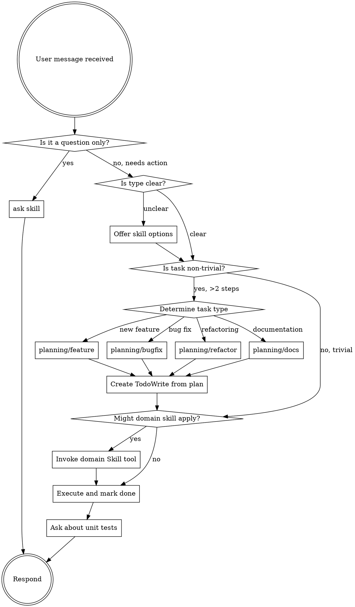

<EXTREMELY-IMPORTANT>
If you think there is even a 1% chance a skill might apply to what you are doing, you ABSOLUTELY MUST invoke the skill.

IF A SKILL APPLIES TO YOUR TASK, YOU DO NOT HAVE A CHOICE. YOU MUST USE IT.

This is not negotiable. This is not optional. You cannot rationalize your way out of this.
</EXTREMELY-IMPORTANT>

## Language Rule

<IMPORTANT>
**ALL output MUST be in English**, regardless of what language the user writes in.

- User writes in Serbian → Respond in English
- User writes in German → Respond in English
- User writes in any language → Respond in English

This ensures consistency and readability across all documentation, plans, code comments, and conversations.
</IMPORTANT>

## How to Access Skills

**In Claude Code:** Use the `Skill` tool. When you invoke a skill, its content is loaded and presented to you—follow it directly. Never use the Read tool on skill files.

**In other environments:** Check your platform's documentation for how skills are loaded.

# Using Skills

## The Planning Rule

<IMPORTANT>
Before starting ANY non-trivial task (more than 2 steps), you MUST invoke the appropriate planning skill.

Planning comes BEFORE implementation. Always.

**NEVER switch to Plan mode.** Always stay in Agent mode and use the planning skills. This ensures:
- Full tool access during planning AND execution
- Plans persist in files (can resume later)
- Single continuous workflow
</IMPORTANT>

**Choose the right planning skill:**
- `planning/feature` - New features (includes changelog + test case prompts)
- `planning/bugfix` - Bug fixes (asks about changelog)
- `planning/refactor` - Improving existing code (best practices, testability, reduce duplication)
- `planning/docs` - Documentation (no changelog)

**After implementation, offer unit tests:**
- Read `testing/unit-tests` skill
- Write tests ONE BY ONE, waiting for user approval after each test

**After tests, offer Pull Request:**
- Read `git/pull-request` skill
- Create PR with Motivation, Technical Details, Test Plan

**Workflow:**
1. Receive user request
2. Determine task type (feature / bugfix / refactor / documentation)
3. If task is non-trivial → invoke appropriate `planning/*` skill
4. **Assess PR scope** - split into multiple PRs if > 800 lines
5. Create TodoWrite list based on planning
6. Invoke domain-specific skills (programming, documentation, testing)
7. Execute with todo tracking
8. **After each step: ask for validation** (see below)
9. Mark each completed task in both TodoWrite AND the plan file
10. **Ask about unit tests** after implementation
11. **Ask about creating PR** after tests

## Step-by-Step Validation (REQUIRED)

<IMPORTANT>
After completing EACH implementation step, you MUST ask for user validation before proceeding to the next step.

**Use the `AskQuestion` tool** for interactive clickable menus instead of text-based options.
</IMPORTANT>

**After each step:**

1. Show a summary of what was implemented:
   - Brief description of changes
   - Key files changed
   - Any decisions made or assumptions

2. Use `AskQuestion` tool with these options:

```json
{
  "title": "Step Validation: [Step Description]",
  "questions": [{
    "id": "validation",
    "prompt": "I've completed [step]. Please review the changes above.",
    "options": [
      {"id": "continue", "label": "✅ Continue - Proceed to next step"},
      {"id": "revert", "label": "⬅️ Revert & Stop - Revert changes and stop"},
      {"id": "improve", "label": "🔄 Improve - Try a different approach"}
    ]
  }]
}
```

**Validation flow:**

```
Complete Step N
      │
      ▼
Show summary of changes
      │
      ▼
AskQuestion (interactive menu)
      │
      ├── "continue" ──────→ Mark step done, proceed to Step N+1
      │
      ├── "revert" ────────→ Revert changes, stop implementation
      │
      └── "improve" ───────→ Revise implementation, ask again
```

**Example:**

First, show the changes:

> **Completed: Step 2 - Add validation to user input**
>
> **Changes:**
> - Added `validate_input()` function in `src/utils/validation.cpp`
> - Added input checks in `process_request()` 
> - Returns `std::optional<error>` on validation failure

Then use AskQuestion tool for the interactive menu.

## When Unclear: Offer Options

If you're not sure which skill applies to the user's request, use `AskQuestion` tool:

```json
{
  "title": "Task Type",
  "questions": [{
    "id": "task_type",
    "prompt": "Which best describes what you need?",
    "options": [
      {"id": "feature", "label": "New feature - Add new functionality"},
      {"id": "bugfix", "label": "Bug fix - Fix something that's broken"},
      {"id": "refactor", "label": "Refactoring - Improve existing code"},
      {"id": "docs", "label": "Documentation - Create or update docs"},
      {"id": "question", "label": "Just a question - No action needed"}
    ]
  }]
}
```

Do NOT guess. When in doubt, ask.

## When Uncertain About Solution: Ask User

<IMPORTANT>
If you're not sure whether a solution is correct or if it's the best/final approach, **ASK THE USER** before proceeding.
</IMPORTANT>

**Ask when:**
- Multiple valid approaches exist with different trade-offs
- You're unsure if the solution fits the project's architecture
- The requirement is ambiguous
- The solution has significant implications (performance, breaking changes, etc.)
- You're making assumptions that could be wrong

**How to ask:**

> "I have a few options for this. Before I proceed:
>
> **Option A:** [Description] - [Trade-offs]
> **Option B:** [Description] - [Trade-offs]
>
> Which approach would you prefer? Or should I consider something else?"

Or for confirmation:

> "I'm planning to [approach]. This assumes [assumption]. Is this correct, or would you prefer a different approach?"

**Do NOT:**
- Assume you know best when multiple valid solutions exist
- Make significant architectural decisions without confirmation
- Proceed with uncertainty when a quick question could clarify

## Questions Without Actions

If the user is asking a question that doesn't require any code changes, file modifications, or implementation:

- Use `ask` skill for explanations, clarifications, or informational requests
- No planning is needed
- No TodoWrite is needed
- Simply answer the question directly

Examples of "ask" scenarios:
- "What does this function do?"
- "How does authentication work in this project?"
- "Explain the difference between X and Y"
- "What's the best practice for...?"

## The Skill Rule

**Invoke relevant or requested skills BEFORE any response or action.** Even a 1% chance a skill might apply means that you should invoke the skill to check. If an invoked skill turns out to be wrong for the situation, you don't need to use it.


